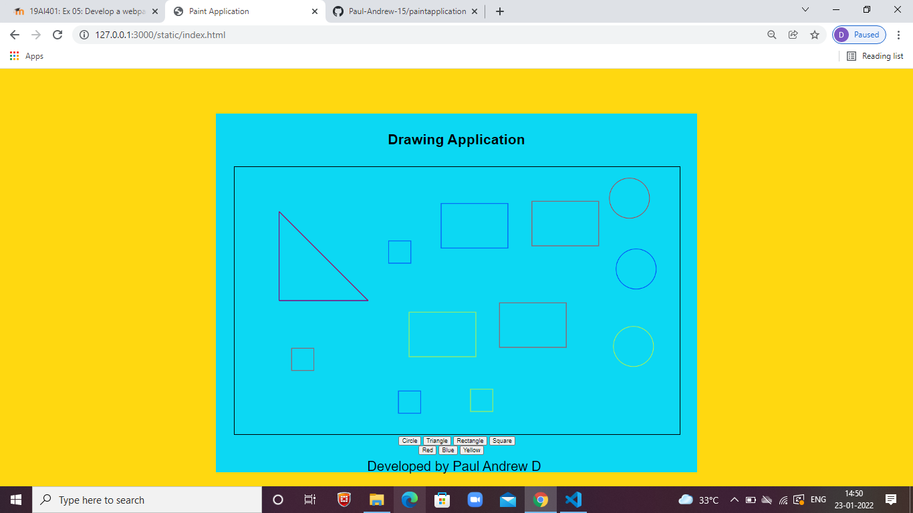

# Web Page for Paint Application

## AIM:

To design a static website for Paint Application using HTML5 canvas.

## DESIGN STEPS:

### Step 1:

Requirement collection.

### Step 2:

Creating the layout using HTML,CSS and canvas.

### Step 3:

Write javascript to capture move events.

### Step 4:

Perform the drawing operation based on the user input.

### Step 5:

Validate the layout in various browsers.

### Step 6:

Validate the HTML code.

### Step 6:

Publish the website in the given URL.

## PROGRAM :

```
<!DOCTYPE html>
<html lang="en">
  <head>
    <meta charset="UTF-8" />
    <meta http-equiv="X-UA-Compatible" content="IE=edge" />
    <meta name="viewport" content="width=device-width, initial-scale=1.0" />
    <title>Paint Application</title>
    <style>
      * {
        box-sizing: border-box;
        font-family: Arial, Helvetica, sans-serif;
      }
      body {
        background-color: rgb(255, 216, 16);
        color: black;
      }
      .container {
        width: 1080px;
        margin-left: auto;
        margin-right: auto;
      }
      .content {
        display: block;
        width: 100%;
        background-color: rgb(12, 216, 243);
        min-height: 800px;
        margin: 100px 50px 0px 0px;
        padding-top: 20px;
      }
      h1 {
        text-align: center;
      }
      .footer {
        display: inline-block;
        width: 100%;
        height: 40px;
        margin: 0px 0px 0px 0px;
        text-align: center;
        padding-top: 10px;
        color: #000000;
        font-style:normal;
        font-size: 30px;
        padding-right: 10px;
      }
      canvas {
        margin-left: 40px;
        margin-right: 40px;
      }
      .canvas1{
            background-color: rgb(12, 216, 243);
            margin-left: 95px;
            text-align: center;
            padding-left: 315px;
        }
        .canvas2{
            background-color: rgb(12, 216, 243);
            margin-left: 95px;
            text-align: center;
            padding-left: 360px;
        }
      .toolbar {
        text-align: center;
      }
      .button{
        text-align: center;
      }
        

    </style>
    <script type="text/javascript">
      var shape;
      var color;
      function myClickEvent(e){
              var ctx = c.getContext("2d");
              ctx.beginPath();
              if(color==1){
                  ctx.strokeStyle='red';
              }else if(color==2){
                  ctx.strokeStyle='yellow';
              }else if(color==3){
                  ctx.strokeStyle='blue';
              }
              if(shape == 0){
                  ctx.arc(e.offsetX,e.offsetY, 45, 0, 2 * Math.PI);
                  ctx.stroke();
                  
              }else if(shape == 1){
      
                  ctx.moveTo(100, 100);
                  ctx.lineTo(100, 300);
                  ctx.lineTo(300, 300);
                  ctx.closePath();
                  ctx.stroke();
                  
                  
                  context.closePath()
              }else if(shape == 2){
                  ctx.rect(e.offsetX,e.offsetY, 150, 100);
                  ctx.stroke();
      
      
              }else if(shape == 3){
                  ctx.rect(e.offsetX, e.offsetY, 50, 50);
                  ctx.stroke();
              }
          }
      
              function circleClicked(){
                  shape=0;
              }
              function triangleClicked(){
                  shape=1;
              }
              function rectangleClicked(){
                  shape=2;
              }
              function squareClicked(){
                  shape=3;
              }
              function redClicked(){
                  color=1;
              }
              function blueClicked(){
                  color=3;
              }
              function yellowClicked(){
                  color=2;
              }
      
      </script>
  </head>
  <body>
    <div class="container">
      <div class="content">
        <h1>Drawing Application</h1>
      </br>
        <canvas
            id="myCanvas"
            width="1000"
            height="600"
            style="border: 1px solid #000000;"
            >
          </canvas>
    <div> 
      <class class="canvas1"></class>
        <input type="button"  id="circle" value="Circle">
        <input type="button" id="line" value="Triangle">
        <input type="button" id="rectangle" value="Rectangle">
        <input type="button" id="square" value="Square">
        
    </div>
    <div>
      <class class="canvas2"></class>
        <input type="button" id="red" value="Red">
        <input type="button" id="blue" value="Blue">
        <input type="button" id="yellow" value="Yellow">
    </div>
          <div class="footer">
            Developed by Paul Andrew D
          </div>
      </div>
    </div>
    <script type ="text/javascript">
      var c = document.getElementById("myCanvas");
      c.addEventListener("click", myClickEvent);
      document.getElementById("circle").addEventListener("click", circleClicked);
      document.getElementById("line").addEventListener("click",  triangleClicked);
      document.getElementById("rectangle").addEventListener("click",rectangleClicked);
      document.getElementById("square").addEventListener("click",squareClicked);
      document.getElementById("red").addEventListener("click",redClicked);
      document.getElementById("blue").addEventListener("click",blueClicked);
      document.getElementById("yellow").addEventListener("click",yellowClicked);
     
  </script>
  </body>
</html>
```

## OUTPUT:



## Result:

Thus a website is designed and validated for paint application using HTML5 canvas.
